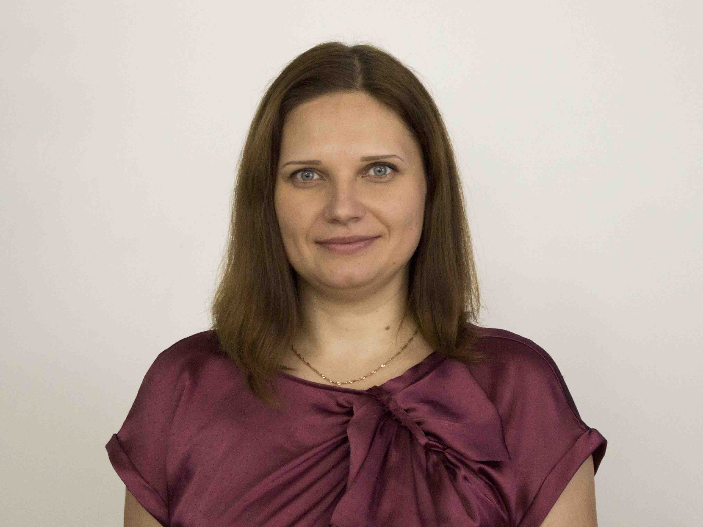

1. [Опис ключових змін до проекту оновленої програми з фізичної культури](#opus)
2. [Детальна таблиця з коментарями до програм та зворотнім зв’язком модераторів](#table)

<table width="100%" border="0" bordercolor="0" cellpadding="0" cellspacing="0">
  <tr border="0" bordercolor="0">
    <td border="0" bordercolor="0">

</td>
    <td valign="bottom" border="0" bordercolor="0"><b>Зленко Наталія Сергіївна</b>
     
<i>Хореограф, вчитель, модератор з фізичної культури</i></td>
  </tr>
</table>

#### Опис ключових змін до проекту оновленої  програми  з фізичної культури {#opus}

Спираючись на пропозиції моїх колег, щодо оновлення програми з фізичної культури, зробила аналіз та запропонувала внесення змін до структури та змісту програми, що впроваджується на сьогодні в українській школі.

Впевнено можна казати, що програма дійсно відповідає всім вимогам Державного стандарту початкової загальної освіти, але ж деякі види і форми реалізації навчальних, оздоровчих і виховних завдань застарілі і потребують реорганізації. І лише дивлячись у майбутнє, а не озираючись на минулі усталені схеми, ми можемо осучаснити українську школу та наважитися до справжніх глибоких змін, заради майбутнього нового освіченого та зацікавленого покоління українських школярів. Цього потребує освіта! Цього потребує школа! Цього потребує вчитель!

Звісно, ми обов'язково повинні враховувати вимоги складання навчальних програм відповідно до Державного стандарту: наступність і прогрес, зручність використання, узгодженість зі стандартами галузі, придатність для всіх учнів. Зважати на основні компетентності, як індикатори результату навчальних досягнень, що відображає базовий зміст програми. Дотримуватись основних компонентів змісту предмету "Фізична культура" : інформаційного, мотиваційного, операційного. 

На мій погляд, є три основні моделі оновлення програми: кардинальна ( зміни запропонованих способів рухової діяльності, прибирання з програми навіть пояснень щодо оцінювання та розрахунку фізичної підготовленості за тестами, введення варіативних модулів), суттєва (реорганізація способів рухової діяльності, зміни програмового змісту), значуща(вилучення застарілих методичних рекомендацій, вимог).

Стисло: осучаснення програми (від команд "Рівняйсь!", "Смирно!" до виконання імпровізаційних танцювальних рухів) з однією метою - зацікавити дітей!

Кардинальні зміни уможливлюють програму з фізичної культури побудувати за принципом вдосконалення фізичних якостей учнів.

Фізичне вдосконалення:
<ul>
<li>аеробна  витривалість;</li>
<li>гнучкість;</li>
<li>м'язова витривалість;</li>
<li>м'язова сила;</li>
<li>гармонійний фізичний розвиток.</li>
</ul>

Так з'являється можливість реалізувати завдання програми не за допомогою бігу за секундоміром, а за допомогою введення варіативних модулів ( футбол, ритмічна аеробіка або хореографія, плавання). Але поки що, для впровадження кардинальних змін, суперечок дуже багато. Вчителі здебільшого вважають корисним прибрати з програми плавання, із школи пересування - танцювальні кроки. Думаю, це пояснюється здебільшого тим, що у більшості шкіл немає басейнів, спортивні зали перевантажені (декілька класів займаються одночасно), урок фізкультури проводить вчитель, в якого немає кваліфікації хореографа чи тренера з плавання.

Якщо ми будемо зважати тільки на те, чого нам не вистачає, ми не зможемо оновити суттєво програму. Пам’ятаємо! Варіативні модулі не є обов’язковими і дають змогу школі обирати вид спорту чи рухової діяльності за наявністю матеріально-технічної бази, зважаючи на регіональні спортивні традиції, кадрове забезпечення та бажання учнів. Тільки дивлячись у майбутнє, ми зрозуміємо, що оновлюючи освітні програми, ми маємо можливість оновити школи. 

Суттєвим оновленням стане реорганізація способів рухової діяльності, на яких побудовано зміст програми. Так, наприклад, прибираючи зі школи пересувань (в свою чергу запропоновані обгрунтовано моїми колегами, а також батьками) лижі, плавання та танцювальні кроки, ми просто бачимо, що розділ залишається фукціонально порожнім. Тому доцільно школу пересувань, школу стрибків та школи сприяння розвитку фізичних здатностей реорганізувати та об'єднати в модуль з загальної фізичної підготовки. Школу культури рухів з елементами гімнастики та школу постави об'єднати в модуль з оздоровчої гімнастики. Це буде потребувати деяких змін у розподілі програмового матеріалу в навчальних годинах для уроків фізичної культури, але загальне навантаження суттєво не зміниться.

Можна також зупинитись на змінах значущих, але тимчасових, які стримують лавину проблем. Це можна порівняти з косметичним ремонтом: старі стіни тиснуть настільки, що й дихати важко і розгорнутися нема де. Застаріле змінимо на сучасне!..тільки...ті  ж квадратні метри залишаються, і прибудинкова територія не потребує змін. Але ... це , колеги, буде лише подих, не довготривалий, але свіжий. Обирати нам. 
Пропозиції і зміни, що запропонували мої колеги я вносила до таблиці оновлення чинного змісту програми. Це:
<ul>
<li>додати у розділ Школи активного відпочинку ігри у бадмінтон, фрісбі та вилучення деяких ігор на зразок: " Клас, струнко!", "На свої місця";</li>
<li>прибрати з програми лижну підготовку і плавання (ігри та вправи в інших розділах, що пов'язані з цими видами рухової діяльності).</li>
</ul>
Плавання( через те, що погляди розійшлися) відокремила у варіативний модуль.
<ul>
<li>танцювальні кроки у розділі Школи пересувань змінити на ритмічну аеробіку.</li>
</ul>

З власного бачення осучаснення предмету "Фізична культура" додала вправи з фітболом та степ - кроки.

І ще важливе, суперечливе питання: 
Якщо ми не оцінюємо фізичну культуру у початковій школі, і як підкреслюють вчителі " пробіг в силу своїх можливостей і «зарах.», то для чого нам додатки "Використання бальної оцінки в системі педагогічного контролю фізичної підготовленості школярів", "Система оцінювання фізичної підготовленості школярів 7-10 років", "Критерії оцінювання навчальних досягнень учнів з предмета «Фізична культура»?

#### Детальна таблиця з коментарями до програм та зворотнім зв’язком модераторів{#table}

Для того, щоб детально ознайомитися з врахованими/неврахованими коментарями дописувачів на EdEra під час першого етапу обговорення, перейдіть за посиланням. 
 
<form align="center">
  <button><a href="https://docs.google.com/document/d/1XEBVVpf0kAPNVJg9kN_FaRzjo-MLz0fF2XXPF4hhhIM/edit">Таблиця з коментарями</a></button>
</form>

<a href="http://hypercomments.com" class="hc-link" title="comments widget">comments powered by HyperComments</a>

